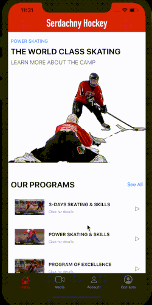

## Serdachny Hockey iOS Mobile App


## Introduction
ENSE 400/477 Capstone Project Fall 2019 - Winter 2020, University of Regina
- **Team Name**: Prime Software
- **About**: This project is in partnership with Serdachny Hockey under the direction of Steve Serdachny. Our team(Jiahao Li, Jinkai Fan, McKenzie Busenius) designed and developed a personalized mobile hockey learning management app with Serdachny Hockey School.  
***
__There are two video links:__
- [Video Project Presentation](https://www.markdownguide.org/cheat-sheet/): In this video presentation, it has a product demo part and a presentation part. In the product demo part, we show how the general design and workflow looks like. In the presentation part, our team delivers a comprehensive demonstration of our team’s design problem/idea and design solution (features and functionality)/product deployment.
- [Demo Video](https://www.markdownguide.org/cheat-sheet/): Complete app demo video link.

## Table of contents
- [Promotional picture](#serdachny-hockey-ios-mobile-app)
- [Introduction](#introduction)
- [Table of contents](#table-of-contents)
- [Demo screenshot](#demo-screenshot)
- [Requirements](#requirements)
- [Installation](#installation)
- [Usage](#usage)
- [Development](#development)
  - [Team meeting notes](#team-meeting-notes)
  - [Documentations](#documentations)
- [Scrum presentation timelines](#scrum-presentation-timelines)
- [Credits](#credits)

## Demo screenshot


## Requirements
- **Software**: [Xcode 11](https://developer.apple.com/xcode/) development tool for MacOS
- **Language**: [Swift 5.1](https://developer.apple.com/swift/)
- **Backend Configuration**: [AWS Amplify Framework](https://aws-amplify.github.io/docs/sdk/ios/start?ref=amplify-iOS-btn) for iOS app development and [AWS S3 Services](https://aws.amazon.com/s3/) for app data storage

## Installation
To get started, install locally:

```sh
git clone  
cd CapstoneProject  
open SerdachnyHockey.xcworkspace/
```
After opening the project:
```sh
Build Project
```

## Usage
There are four main screens in this app: **Home Page**, **Media Page**, **UserAccount Page**, **Contact Page**.

## Development
### Project management
> [Project Management Boards](ProcessAndProjectDocumentation/ProcessDocumentation/Project-Managment-Boards): Team daily schedule purpose over the development.  
> [User Story Maps](ProcessAndProjectDocumentation/ProcessDocumentation/User-Story-Maps): Each screen design process detail.

### Documentations
> [MVP1 Descriptions](ProcessAndProjectDocumentation/ProcessDocumentation/MVP_Descriptions.pdf): Overview of minimal viable product.  
> [Requirements Document](ProcessAndProjectDocumentation/ProjectDocumentation/Requirements%20Document.pdf): This document is overview of the system design and the breakdown of the design decisions.  
> [Project Experience Report](ExcecutiveSummaries/ProjectExperienceReport.pdf): This document provides an overview of the project experience and group review, a list of possible functionality improvement strategies.  
> [Code Quality Report](ExcecutiveSummaries/CodeQualityReport.pdf): This document provides an overview to application code structures and pattern review referring to The fundamental Code Review Checklist reference.  
> [Testing Plan Report](ProcessAndProjectDocumentation/ProjectDocumentation/Testing%20Plan.pdf): This document provides an overview to application code structures and pattern review referring to The fundamental Code Review Checklist reference.

## Scrum presentation timelines
- ENSE 400 Capstone Start-up Scrums  
    - [Student Project Introduction](ProcessAndProjectDocumentation/ProcessDocumentation/Presentations/ENSE400/Spet-27th-Student-Project-Introductions.pdf)  
    - [Bi-Weekly Scrum #1](ProcessAndProjectDocumentation/ProcessDocumentation/Presentations/ENSE400/Oct-11th-Bi-Weekly-Scrum.pdf)  
    - [Bi-Weekly Scrum #2](ProcessAndProjectDocumentation/ProcessDocumentation/Presentations/ENSE400/Oct%2025th%20Bi-Weekly%20Scrum.pdf)  
    - [Mentor Scrum](ProcessAndProjectDocumentation/ProcessDocumentation/Presentations/ENSE400/Nov-22nd-Mentor-Scrum.pdf)  
- ENSE 477 Capstone Project Scrums
    - [1st-10-minute Scrum](ProcessAndProjectDocumentation/ProcessDocumentation/Presentations/ENSE477/Jan-14th-Bi-Weekly-Scrum.pdf)  
    - [2nd-15-minute Scrum](ProcessAndProjectDocumentation/ProcessDocumentation/Presentations/ENSE477/Jan%2028th%20Bi-Weekly%20Scrum.pdf)  
    - [3rd-15-minute Scrum](ProcessAndProjectDocumentation/ProcessDocumentation/Presentations/ENSE477/Feb-25th-Bi-Weekly-Scrum.pdf)  
    - [1st-project-bazaar Scrum](ProcessAndProjectDocumentation/ProcessDocumentation/Presentations/ENSE477/Mar-10th-Bi-Weekly-Scrum.pdf)  
 
## Credits


