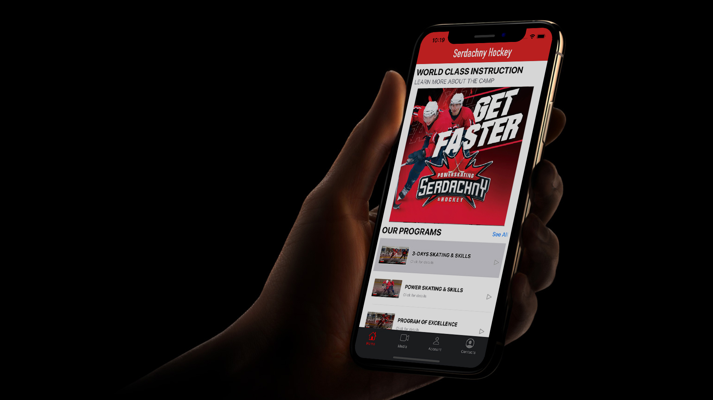

## Serdachny Hockey iOS Mobile App



## Table of contents
- [Introduction](#introduction)
- [Video Links](#video-links)
- [Project Code](#project-code)
- [Project Development](#project-development)
  - [Process Documentation](#Process-documentation)
    - [Scrum Presentation Timelines](#scrum-presentation-timelines)
  - [Project Documentation](#project-documentation)
- [System Requirements](#system-requirements)
- [Installation](#installation)
- [Usage](#usage)
- [Credits](#credits)

## Introduction
ENSE 400/477 Capstone Project Fall 2019 - Winter 2020, University of Regina
- **Team Name**: Prime Software
- **Team Members**: Jinkai Fan, Jiahao Li, McKenzie Busenius
- **Problem Statement**: We are attempting to develop an iOS-based mobile management platform that will combine media and marketing capabilities including free development videos and a quick redirect to our customers’ existing online registration content management system that is a web-based application. In addition, we are attempting to upgrade a hockey training system to a dynamic user account configuration including capturing, storing, and modifying video content all within the application.
- **Project Vision**: Our project vision is to apply the Minimum Viable Product model coupled with an agile approach in software engineering. This is guiding us to provide functional software at every point in project deliverables.  We are carefully designing and implementing the ability to scale as well as keeping the consideration of security a top priority.
***

## Video links
- [Video Project Presentation](https://www.markdownguide.org/cheat-sheet/): In this video presentation, our team delivers a comprehensive demonstration of our problem and design solution include app features and functionality for product deployment.
- [Demo Video](https://www.markdownguide.org/cheat-sheet/): In the product demo, we show the general design and what the project workflow looks like.

## Project Code
> [Project Code](ProjectCode/SerdachnyHockey): Find all our project code here.

## Project Development
#### Process Documentation
> [Project Management Boards](ProcessAndProjectDocumentation/ProcessDocumentation/Project-Managment-Boards): Team daily schedule purpose over the development.  
> [User Story Maps](ProcessAndProjectDocumentation/ProcessDocumentation/User-Story-Maps): Each screen design process detail.  
> [MVP Descriptions](ProcessAndProjectDocumentation/ProcessDocumentation/MVP_Descriptions.pdf): Overview of minimal viable product.
#### Scrum Presentation Timelines
- ENSE 400 Capstone Start-up Scrums  
    - [Student Project Introduction](ProcessAndProjectDocumentation/ProcessDocumentation/Presentations/ENSE400/Spet-27th-Student-Project-Introductions.pdf)  
    - [Bi-Weekly Scrum #1](ProcessAndProjectDocumentation/ProcessDocumentation/Presentations/ENSE400/Oct-11th-Bi-Weekly-Scrum.pdf)  
    - [Bi-Weekly Scrum #2](ProcessAndProjectDocumentation/ProcessDocumentation/Presentations/ENSE400/Oct%2025th%20Bi-Weekly%20Scrum.pdf)  
    - [Mentor Scrum](ProcessAndProjectDocumentation/ProcessDocumentation/Presentations/ENSE400/Nov-22nd-Mentor-Scrum.pdf)  
- ENSE 477 Capstone Project Scrums
    - [1st-10-minute Scrum](ProcessAndProjectDocumentation/ProcessDocumentation/Presentations/ENSE477/Jan-14th-Bi-Weekly-Scrum.pdf)  
    - [2nd-15-minute Scrum](ProcessAndProjectDocumentation/ProcessDocumentation/Presentations/ENSE477/Jan%2028th%20Bi-Weekly%20Scrum.pdf)  
    - [3rd-15-minute Scrum](ProcessAndProjectDocumentation/ProcessDocumentation/Presentations/ENSE477/Feb-25th-Bi-Weekly-Scrum.pdf)  
    - [1st-project-bazaar Scrum](ProcessAndProjectDocumentation/ProcessDocumentation/Presentations/ENSE477/Mar-10th-Bi-Weekly-Scrum.pdf) 

#### Project Documentation
> [Requirements Document](ProcessAndProjectDocumentation/ProjectDocumentation/Requirements%20Document.pdf): This document is overview of the system design and the breakdown of the design decisions.  
> [Project Experience Report](ExcecutiveSummaries/ProjectExperienceReport.pdf): This document provides an overview of the project experience and group review, a list of possible functionality improvement strategies.  
> [Code Quality Report](ExcecutiveSummaries/CodeQualityReport.pdf): This document provides an overview to application code structures and pattern review referring to The fundamental Code Review Checklist reference.  
> [Testing Plan Report](ProcessAndProjectDocumentation/ProjectDocumentation/Testing%20Plan.pdf): This document provides an overview to application code structures and pattern review referring to The fundamental Code Review Checklist reference.
 
## System Requirements
- **Software**: [Xcode 11](https://developer.apple.com/xcode/) development tool for MacOS
- **Language**: [Swift 5.1](https://developer.apple.com/swift/)
- **Backend Configuration**: [AWS Amplify Framework](https://aws-amplify.github.io/docs/sdk/ios/start?ref=amplify-iOS-btn) for iOS app development and [AWS S3 Services](https://aws.amazon.com/s3/) for app data storage

## Installation
To get started, install locally:

```sh
git clone  
cd CapstoneProject  
open SerdachnyHockey.xcworkspace/
```
After opening the project:
```sh
Build Project
```

## Usage
There are four main screens in this app: **Home Page**, **Media Page**, **UserAccount Page**, **Contact Page**.
 
## Credits
Xcode MacOS  
[Node.js](https://nodejs.org/en/)    
[npm](https://www.npmjs.com)
